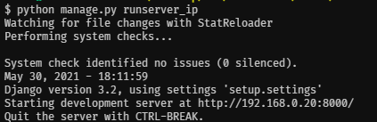
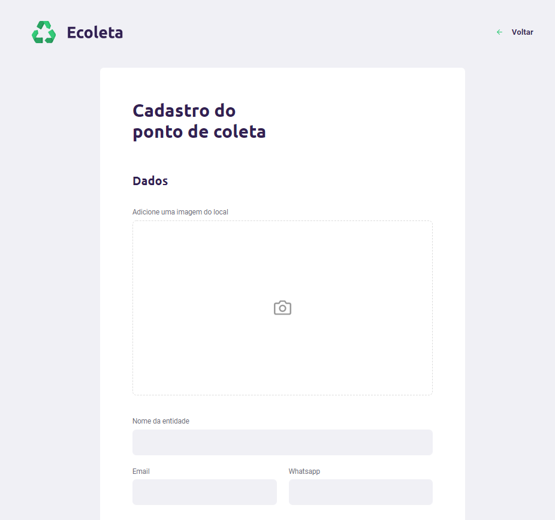
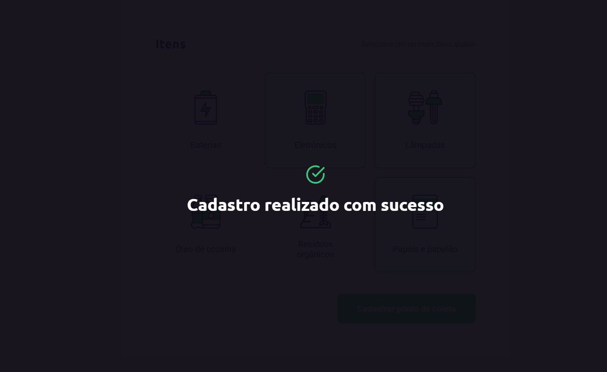
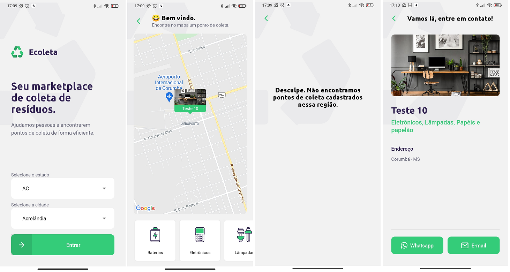

<h1 align="center">
    
</h1>

<h4 align="center">
  🚀 Next Level Week 1
</h4>

<p align="center">
 

  
</p>

<p align="center">
  <a href="#-tecnologias">Tecnologias</a>&nbsp;&nbsp;&nbsp;|&nbsp;&nbsp;&nbsp;
  <a href="#-projeto">Projeto</a>&nbsp;&nbsp;&nbsp;|&nbsp;&nbsp;&nbsp;
  <a href="#-instalação">Instalação</a>
</p>

## 🚀 Tecnologias

Esse projeto foi desenvolvido com as seguintes tecnologias:

- [Django](https://www.djangoproject.com/)
- [Django-Rest-Framework](https://www.django-rest-framework.org/)
- [Cloudinary](https://cloudinary.com/)
- [React](https://reactjs.org)
- [React Native](https://facebook.github.io/react-native/)
- [Expo](https://expo.io/)

## 💻 Projeto
**Ecoleta foi feito para ajudar pessoas a encontrarem pontos de coleta de forma eficiente. É um marketplace de coleta de resíduos.**

## Instalação
### Pré requisitos
Ter instalado:
- [Python](https://www.python.org/downloads/)
- [Node](https://nodejs.org/en/download/)
- [Yarn](https://classic.yarnpkg.com/en/docs/install/)

### Backend
#### Primeiro: renomear arquivo com variáveis de ambiente
-  **Renomear _backend/setup/env_example.py_ para _backend/setup/env.py_**

#### Segundo: no terminal, rodar
```sh
# Entrar na pasta dos arquivos do backend
cd backend_django

# Criar um ambiente virtual
python -m venv venv

# Ativar o ambiente virtual
. venv/Scripts/activate

# Instalar os pacotes necessários
pip install -r requirements.txt

# Executar as migrações
python manage.py migrate

# Criar instâncias dos items de coleta
python populate.py

# Obter endereço para o seu pc servir os dados da API para os dispostivos da sua rede
python get_api_route.py
```
**O endereço será exibido em tela. Guarde-o. Será necessário colocá-lo no frontend como ROTA_API**

#### Por fim: deixar a API rodando

```sh
# Já executará com seu endreço IP
python manage.py runserver_ip
```
<h1 align="center">
    
</h1>

### OBS:
Usei o *Cloudinary* para salvar as imagens dos Spots. Mas não é necessário.

## Frontend
#### Primeiro: adicionar endereço do backend
- Abrir *web/src/services/api.js* e adicionar o endereço da sua API (ROTA_API)

#### Segundo: no terminal, rodar
```sh
# Entrar na pasta dos arquivos do frontend
cd frontend

# Instalar os pacotes do projeto
yarn install

# Rodar
yarn start
```

<h1 align="center">
    
    
    
</h1>

## Mobile
#### Primeiro: adicionar endereço do backend
- Abrir *mobile/src/services/api.js* e adicionar o endereço da sua API (ROTA_API)

#### Segundo: no terminal, rodar
```sh
# Entrar na pasta dos arquivos do frontend
cd mobile

# Instalar os pacotes do projeto
yarn install

# Rodar
expo start
```

#### Terceiro: rodar expo no celular
- Abrir expo no celular
- Ler QR code e executar o app

<h1 align="center">
    
</h1>